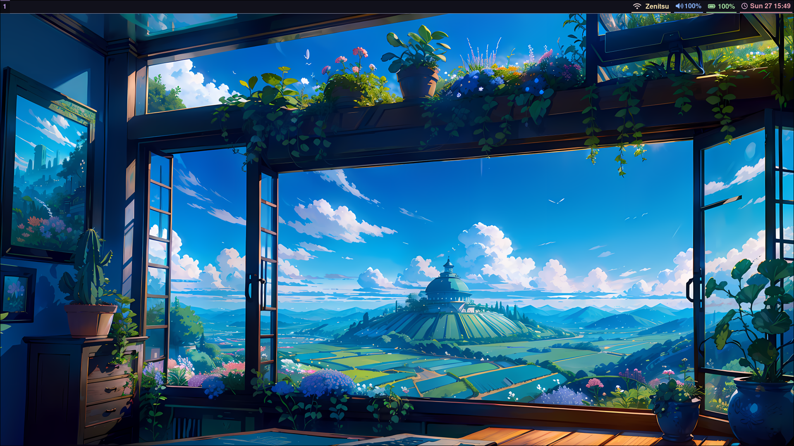
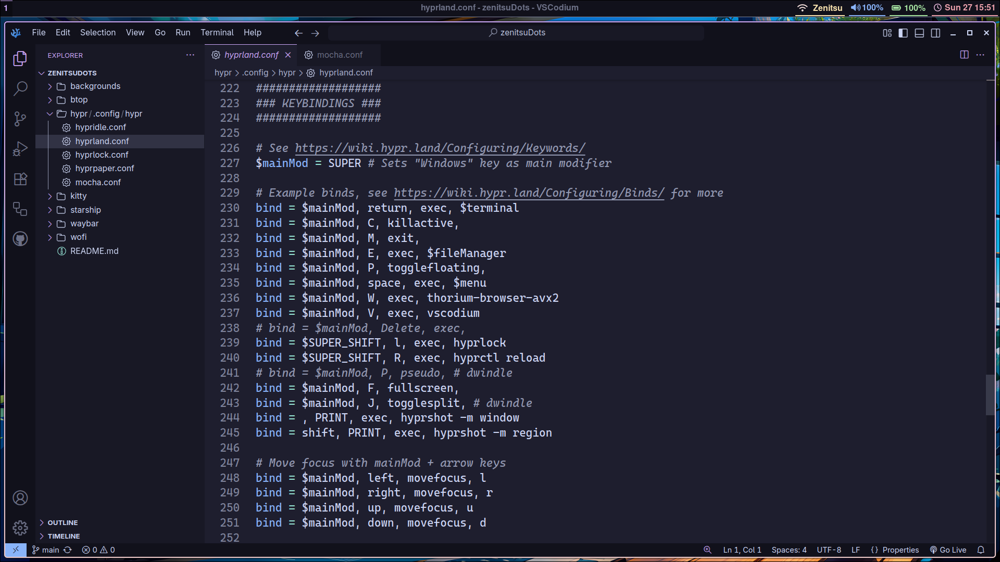
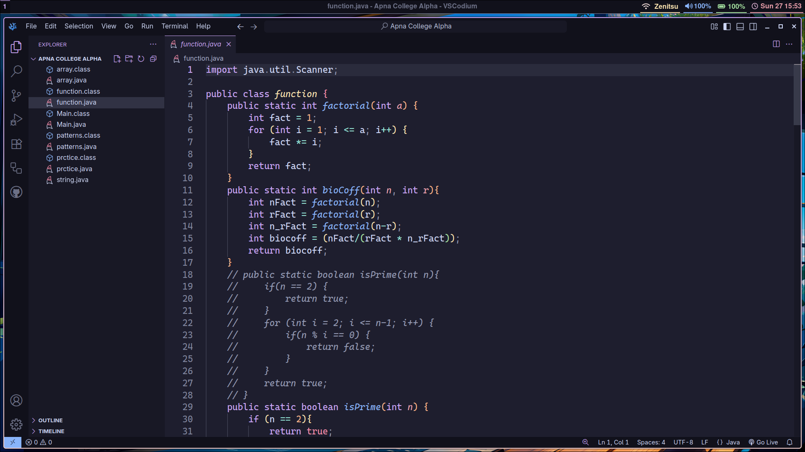
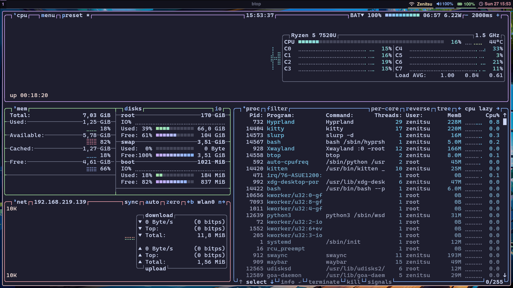
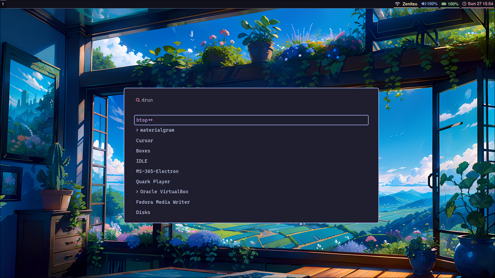
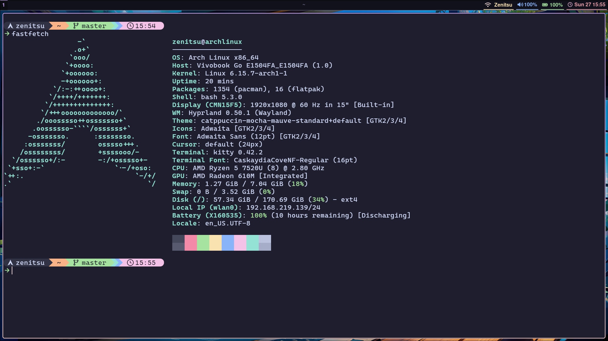

*Hyprland desktop overview*

*Keybinds*

*Catppuccin for VScode*

*Btop with Catppuccin*

*Wofi apps menu*

*Kitty Terminal*
*My Hyprland dotfiles use the **Catppuccin Mocha** flavour theme across the entire system for a consistent look.*

# 🚀 Hyprland Setup

> **📝 Note:** Install an AUR helper like `yay` before proceeding.

---

## 📦 Dependencies Installation

### 🛠️ Base Packages

```bash
sudo pacman -Sy hyprland kitty wofi waybar hyprpaper hypridle swaync hyprshot hyprlock starship nwg-look btop polkit-gnome
```

### 🎨 Theme and Font

```bash
yay -Sy ttf-cascadia-code-nerd catppuccin-gtk-theme-mocha btop-theme-catppuccin
```

### 🧰 Applications I Use

```bash
yay -Sy thorium-browser-avx2-bin vscodium-bin
```

---

## ⚙️ Dotfiles Installation

> **📝 Note:** Install GNU Stow:
> ```bash
> sudo pacman -S stow
> ```
> Or manually copy files from the repo to your `.config` directory.

### 1️⃣ Clone the dotfiles repo

```bash
git clone https://github.com/aryanluhar76/zenitsuDots.git
```

### 2️⃣ Link files using stow

```bash
cd zenitsuDots
stow .
```

- [ ] **Keep the cloned git folder!**  
  _Stow uses symlinks, so the folder must remain for your dotfiles to work._

---

## 🎨 VSCode Theming: Catppuccin Mocha & Icons

For a consistent look in VSCode:

1. **Install the Catppuccin Mocha Theme:**
   - Open the Extensions sidebar (`Ctrl+Shift+X`).
   - Search for `Catppuccin Mocha` and install the official theme extension.
2. **Install a Matching Icon Pack:**
   - Recommended: [Catppuccin Icons](https://marketplace.visualstudio.com/items?itemName=catppuccin.catppuccin-vsc-icons) or [Material Icon Theme](https://marketplace.visualstudio.com/items?itemName=PKief.material-icon-theme).
   - Search and install from the Extensions sidebar.
3. **Activate the Theme and Icons:**
   - Press `Ctrl+K Ctrl+T` to select the Catppuccin Mocha color theme.
   - For icons, search for "File Icon Theme" in the Command Palette (`Ctrl+Shift+P`) and select your installed icon pack.

---

## 💫 Terminal Prompt Setup (Starship)

> For a beautiful and customizable prompt, I use [Starship](https://starship.rs/).

- For **bash** (`.bashrc`):

  ```bash
  eval "$(starship init bash)"
  ```

- For **zsh** (`.zshrc`):

  ```bash
  eval "$(starship init zsh)"
  ```

---

✨ **Enjoy your new setup!** If you want more interactive scripts or clickable badges, let me know!

